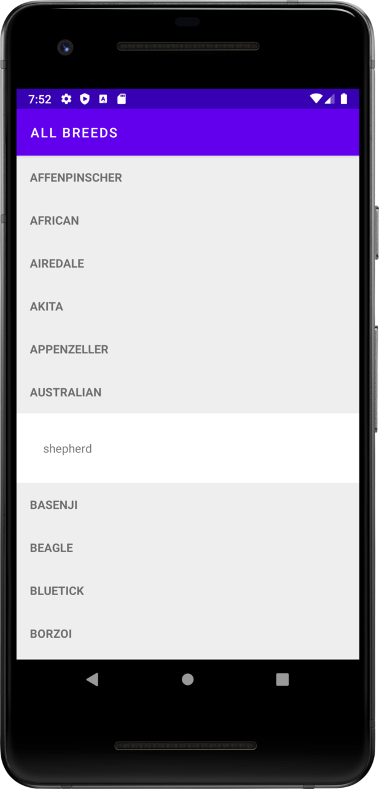
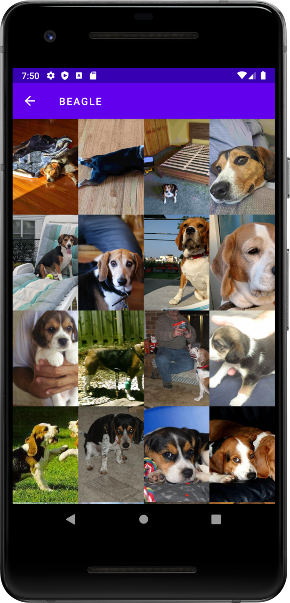

# Dog Friendly

This application make use of the Dogs Api hosted [here](https://dog.ceo/dog-api/). Currently has two screens, the first
screen displays a clickable vertical list of all dog breeds and their corresponding sub breeds. The second screen
shows a grid list of all images pertaining to the selected breed.

Please find below more details...

## Clean architecture with 3 layers
- Data (for database, API and preferences code)
- Domain (for business logic and models)
- Presentation/App (for UI logic, with [MVI](https://www.raywenderlich.com/817602-mvi-architecture-for-android-tutorial-getting-started))

## Tests
- Unit tests
- Application tests
- Activity tests (with [Espresso](https://google.github.io/android-testing-support-library/docs/espresso/))

## Other useful features
- Dependency injection (with [Hilt](http://google.github.io/hilt/))
- Reactive programming with [RXJAVA](https://reactivex.io/)
- Google [Material Design](https://material.io/blog/android-material-theme-color) library
- Quick cached Image loading (with [Picasso](https://square.github.io/picasso/))
- Networking (with [Retrofit](https://square.github.io/retrofit/))
- Flat layout hierarchy (with [Constraint layouts](https://developer.android.com/jetpack/androidx/releases/constraintlayout))
- Multi Screen Segmentation (with [Fragments](https://developer.android.com/jetpack/androidx/releases/fragment))
- Nagivation (with [Navigation Library](https://developer.android.com/guide/navigation/navigation-migrate))
- Android lifecyle aware components (with [Lifecycle](https://developer.android.com/jetpack/androidx/releases/lifecycle))
- Fluid list loading (with [Recycler View](https://developer.android.com/jetpack/androidx/releases/recyclerview))
- Data Persistence (with [Room](https://developer.android.com/jetpack/androidx/releases/room))
- Data surviving configuration changes (with [ViewModel](https://developer.android.com/topic/libraries/architecture/viewmodel))
- Type safe dependency management (with [Kotlin DSL](https://kotlinlang.org/docs/type-safe-builders.html))
- Android architecture components to share ViewModels during configuration changes

| All Breeds | Breed Details |
|----------------------------|------------------------|
| |  |

# Getting started

### Script
1. Clone this repository preferably with Android Studio
2. Build project and then run application. In the situation where you are asked about trusting the application please do select *yes*

# Notes
- Dog-Friendly has offline support. Data is retrieved from remote when data is established and saved.

# Future Improvements
- Network notification when data is restored.
- Make UI Improvements and possibly introduce introducing [compose](https://developer.android.com/jetpack/androidx/releases/compose)

# Issues faced
- Implementing instrumentation tests with *Hilt* not working as expected.
